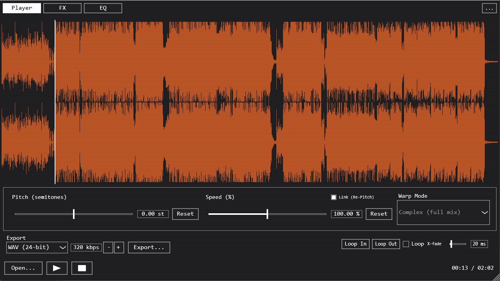
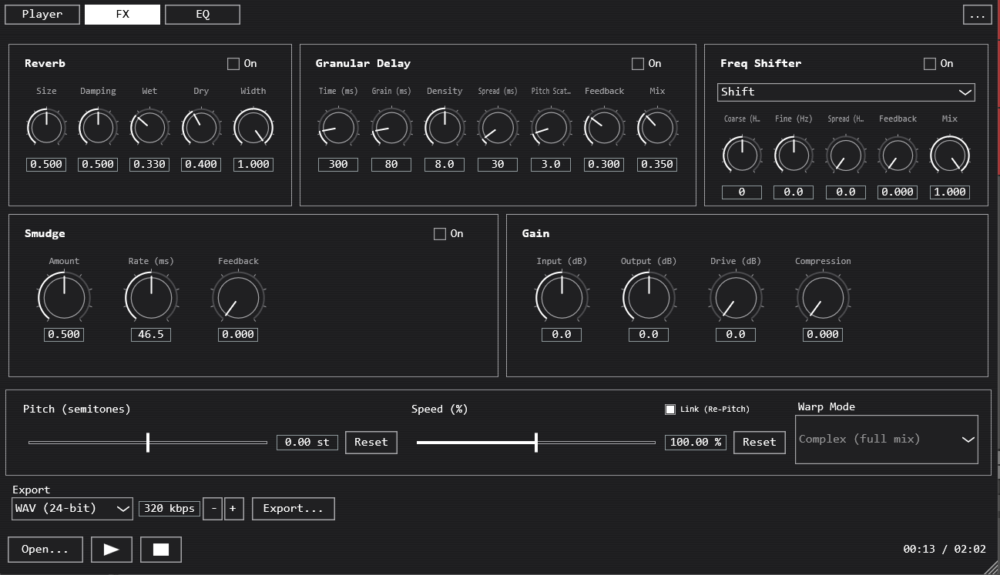
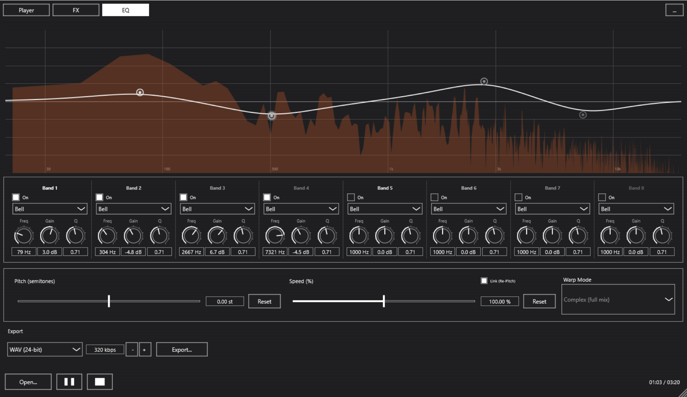

# SPANDEX

A repitch/warp player VST3/Standalone plugin built with JUCE. Load a track, scrub its waveform,
and stretch it in real time -- either linked "Re-Pitch" (pitch and speed move together, classic
turntable-style) or independent Warp modes powered by Rubber Band -- then shape it through a
built-in FX chain and 8-band EQ before exporting or recording the result in your DAW.



## Features

- **Waveform playback** with click/drag scrub, scroll-to-zoom, shift-drag to pan, and a
  loop region (Loop In/Out) with a Sampler-style Loop Mode (Forward/Ping-Pong/Reverse) and a
  true crossfade at the loop point, not just a click-avoiding dip.
- **Pitch/Speed control**, either **Link (Re-Pitch)** (speed and pitch move together, like a
  turntable pitch fader) or independent via a selectable **Warp Mode** -- Beats (percussive),
  Tones (monophonic), Texture (pads/ambient), or Complex/Complex Pro (full mix).
- **Runtime GUI themes** -- Default, Matrix (phosphor green terminal), and Amber Terminal,
  switchable from the "..." menu without restarting.
- **Export** (Standalone only -- inside a DAW, just record/resample SPANDEX's output on another
  track): WAV/AIFF/FLAC/MP3 at full offline quality, matching whatever pitch/speed/warp/FX
  settings are currently dialed in.



**FX chain**: Reverb, Granular Delay, Frequency Shifter/Ring Modulator, Smudge (a spectral
freeze/smear effect), Lossy (a spectral codec-artifact emulator, Goodhertz Lossy style, for
"bad cellphone codec" degradation), and a Drive/Clip bus stage (tanh saturation plus a
frequency-domain hard clipper for a harsher, more distorted character than plain compression).



**8-band parametric EQ** (high-pass, low-pass, shelves, bell, notch, band-pass) with a live
spectrum analyzer drawn behind the curve, auto-normalized to the signal's own peak.

## Installing

No packaged release yet -- see **Building from source** below. The repo includes a Windows
installer script (`installer/SPANDEX.iss`, built with [Inno Setup](https://jrsoftware.org/isinfo.php))
that installs the Standalone app and/or the VST3 to the shared system plugin folder. A macOS
build runs via GitHub Actions on every push to `main` (see `.github/workflows/macos-build.yml`)
-- grab the `SPANDEX-macOS-arm64-VST3`/`-Standalone` artifacts from the
[Actions tab](../../actions) if you want to test on Apple Silicon without building locally.

## Using it

1. **Open...** (or drag a file onto the window) to load a track.
2. Click or drag the waveform to seek/scrub; scroll to zoom, shift-drag to pan, double-click to
   reset the view. Set **Loop In**/**Loop Out** at the current position and toggle **Loop** to
   repeat that region -- raise **X-fade** if you hear a click at the loop point.
3. **Pitch**/**Speed**: toggle **Link (Re-Pitch)** for turntable-style linked control, or leave it
   unlinked and pick a **Warp Mode** for independent pitch/time.
4. **FX tab**: dial in Reverb, Granular Delay, Frequency Shifter, Smudge, and Lossy (each has its
   own on/off toggle), plus Input/Output trim and Drive/Clip on the Gain card.
5. **EQ tab**: drag a band's node on the graph to set frequency/gain, scroll on a node for Q, or
   use the strip below for exact values.
6. **Export** (Standalone): pick a format and click Export... to render offline at full quality.

## How it works

The processing graph is `StretchAudioSource -> EffectsChain -> ResamplingAudioSource`, shared
identically between the Standalone app and the VST3 (`SpandexAudioProcessor` just drives the
same `AudioEngine` the Standalone's `MainComponent` owns, so there's exactly one code path for
DSP regardless of which format you're running).

**Re-Pitch mode** bypasses Rubber Band entirely and reads the source buffer at a resampled rate
with linear interpolation -- cheap and exact, at the cost of pitch and speed being locked
together. **Warp modes** feed a `RubberBandStretcher` in real-time streaming mode, with a
different transient-detector/window/formant preset per mode (see
`StretchAudioSource::optionsForWarpMode`) approximating Ableton's Beats/Tones/Texture/Complex
character.

Looping supports three Sampler-style Loop Modes -- Forward (plain repeat), Ping-Pong (alternates
direction at each boundary instead of wrapping, so there's no discontinuity to smooth over: reading
forward through a point then backward from it is already seamless), and Reverse (plays the region
backward, wrapping start-to-end the same way Forward wraps end-to-start). The crossfade at a
Forward/Reverse wrap is a true two-stream blend -- the loop's own boundary content mixed with
material from just outside the region (the "postroll" past the loop-out point for Forward, the
"preroll" before the loop-in point for Reverse), the way sampler loop crossfades typically work --
rather than the simpler approach of ducking the volume to silence and back at every repeat, which
leaves an audible dip on sustained/looping material. It's exact per-sample in Re-Pitch mode, and in
the Warp path the source audio fed to Rubber Band is pre-blended across the wrap so the stretcher
never sees a discontinuity there either (no per-loop reset needed, unlike a Ping-Pong direction
flip, which Rubber Band can't reverse mid-stream without one). Paulstretch keeps a simpler
equal-power duck instead, since its own analysis window is already far wider than a typical
crossfade and would smear across the seam regardless.

The Granular Delay reads a stream of short, randomly-spawned, Hann-windowed grains back from a
delay history buffer, each with its own pitch/pan jitter -- normalized by expected overlap
(density x grain size), with a feedback-tap saturator *and* a separate fast-attack output limiter
as two independent safety nets against runaway buildup at extreme density/feedback settings.
Smudge is a streaming STFT where each bin's complex value blends with what was there last frame
(`held = held*amount + new*(1-amount)`) rather than replacing it outright; changing its window
size (Rate) mid-stream is sandwiched between a fade-out/fade-in so resizing the FFT doesn't click.
Drive is a straightforward tanh waveshaper (0dB = bypassed/clean). Clip is a second streaming
STFT alongside Smudge/Lossy: each hop's per-bin magnitude is capped to an Amount-controlled
ceiling (an absolute reference against the window's own full scale, not scaled to the input's
level) and blended against the dry spectrum by that same knob, with makeup gain added back in
proportionally. Because the ceiling doesn't adapt to level, loud content (bins mostly above it)
gets clipped down while quiet content (bins mostly already below it) mainly just picks up the
makeup gain -- so it still reads as the loud/quiet gap collapsing, the way the compressor it
replaced did, but through per-frequency clipping instead of one shared gain-reduction envelope,
which lands as more overtly distorted/present rather than just "less dynamic." Lossy is a
streaming STFT (1024-point window, 256-sample hop), not a time-domain
bitcrusher - each hop's magnitude spectrum is quantized to a `Bits`-controlled number of steps
(relative to the window's own full-scale reference, not raw FFT units, so the control's meaning
doesn't depend on window size) and each bin's phase is randomized by `Jitter` * up to +/-pi. That
quantized/jittered "wet" spectrum only refreshes at the `Rate (Hz)` rate - low rates hold an old
frame for a smeared, underwater texture, high rates refresh almost every hop for a garbled,
glitchy one - while the dry side of the `Mix` blend always reads the current hop's actual
spectrum, so Mix at 0 is a true bypass (still delayed by the STFT's window latency) no matter how
slow Rate is set. Phase jitter specifically, not just magnitude crunch, is what gives this a
"lost sync" cellphone-codec character a bitcrusher can't produce - real low-bitrate speech codecs
lose phase coherence between frames the same way.


Every DSP change is verified through a hidden `--selftest <input.wav> <outputDir>` CLI flag
(`Source/SelfTest.cpp`) that renders offline under a battery of known settings and logs numeric
assertions (RMS levels, peak tracking, frequency detection, stability under worst-case
parameters) rather than relying on listening or screenshots.

## Building from source

Requires CMake 3.22+ and MSVC (Visual Studio 2022 Build Tools) on Windows, or Xcode's clang on
macOS. JUCE and Rubber Band are git submodules (`libs/JUCE`, `libs/rubberband`) -- clone with
`--recurse-submodules`, or run `git submodule update --init --recursive` after the fact. MP3
export uses libmp3lame, built from source via [vcpkg](https://github.com/microsoft/vcpkg) (not
vendored in the repo):

```
git clone https://github.com/microsoft/vcpkg.git tools/vcpkg
./tools/vcpkg/bootstrap-vcpkg[.sh|.bat]
./tools/vcpkg/vcpkg install mp3lame --triplet <x64-windows-static-md | arm64-osx>

cmake -S . -B build -DCMAKE_TOOLCHAIN_FILE=tools/vcpkg/scripts/buildsystems/vcpkg.cmake -DVCPKG_TARGET_TRIPLET=<triplet-from-above>
cmake --build build --config Release
```

Built artifacts land in `build/SPANDEX_artefacts/Release/`. See
`.github/workflows/macos-build.yml` for a complete, known-working macOS build recipe (Ninja
generator, `arm64-osx` triplet, `CMAKE_OSX_DEPLOYMENT_TARGET=11.0`).

To build the Windows installer, install [Inno Setup](https://jrsoftware.org/isinfo.php) and run
`ISCC.exe installer/SPANDEX.iss`.

## Project layout

```
Source/
  Audio/               StretchAudioSource, EffectsChain, per-effect DSP (GranularDelay,
                        SmudgeProcessor, FreqShifter, LossyProcessor), AudioEngine, AudioFileLoader
  Export/               offline render pipeline (ExportEngine)
  UI/                    waveform, transport/loop/pitch/speed/warp controls, FX/EQ panels,
                          AppLookAndFeel + Theme registry
  PluginProcessor/Editor  VST3 wrapper around AudioEngine/MainComponent
  MainComponent           top-level layout shared by Standalone and VST3
  SelfTest                offline DSP verification harness (--selftest CLI flag)
installer/               Inno Setup installer script (Windows)
.github/workflows/       macOS CI build
```

## Known limitations

- No packaged release yet -- build from source, or grab a macOS artifact from Actions.
- The macOS CI build targets Apple Silicon (`arm64-osx`) only; Intel Macs aren't currently built.
- Rubber Band Library is used under its GPLv2 license.
