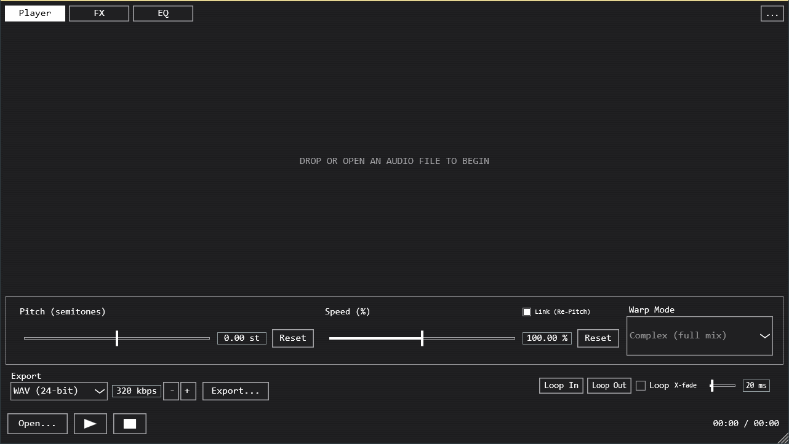

# SPANDEX

A repitch/warp player VST3/Standalone plugin built with JUCE. Load a track, scrub its waveform,
and stretch it in real time -- either linked "Re-Pitch" (pitch and speed move together, classic
turntable-style) or independent Warp modes powered by Rubber Band -- then shape it through a
built-in FX chain and 8-band EQ before exporting or recording the result in your DAW.



## Features

- **Waveform playback** with click/drag scrub, scroll-to-zoom, shift-drag to pan, and a
  loop region (Loop In/Out) with an adjustable crossfade to keep the loop point click-free.
- **Pitch/Speed control**, either **Link (Re-Pitch)** (speed and pitch move together, like a
  turntable pitch fader) or independent via a selectable **Warp Mode** -- Beats (percussive),
  Tones (monophonic), Texture (pads/ambient), Complex/Complex Pro (full mix), or Paulstretch (a
  real phase-randomizing FFT stretcher for extreme slow-motion/ambient territory).
- **FX chain**: Reverb, Granular Delay (Ableton "Granular Mirror Maze" style, with a built-in
  output limiter), Frequency Shifter/Ring Modulator, Smudge (a spectral freeze/smear a la
  FabFilter Saturn 2), and a Drive/Compression bus stage (OTT-style aggressive compressor blended
  in via a dry/wet knob, plus tanh saturation).
- **8-band parametric EQ** (high-pass, low-pass, shelves, bell, notch, band-pass) with a live
  spectrum analyzer drawn behind the curve, auto-normalized to the signal's own peak.
- **Runtime GUI themes** -- Default, Matrix (phosphor green terminal), and Amber Terminal,
  switchable from the "..." menu without restarting.
- **Export** (Standalone only -- inside a DAW, just record/resample SPANDEX's output on another
  track): WAV/AIFF/FLAC/MP3 at full offline quality, matching whatever pitch/speed/warp/FX
  settings are currently dialed in.

## Installing

No packaged release yet -- see **Building from source** below. The repo includes a Windows
installer script (`installer/SPANDEX.iss`, built with [Inno Setup](https://jrsoftware.org/isinfo.php))
that installs the Standalone app and/or the VST3 to the shared system plugin folder. A macOS
build runs via GitHub Actions on every push to `main` (see `.github/workflows/macos-build.yml`)
-- grab the `SPANDEX-macOS-arm64-VST3`/`-Standalone` artifacts from the
[Actions tab](../../actions) if you want to test on Apple Silicon without building locally.

## Using it

1. **Open...** (or drag a file onto the window) to load a track.
2. Click or drag the waveform to seek/scrub; scroll to zoom, shift-drag to pan, double-click to
   reset the view. Set **Loop In**/**Loop Out** at the current position and toggle **Loop** to
   repeat that region -- raise **X-fade** if you hear a click at the loop point.
3. **Pitch**/**Speed**: toggle **Link (Re-Pitch)** for turntable-style linked control, or leave it
   unlinked and pick a **Warp Mode** for independent pitch/time.
4. **FX tab**: dial in Reverb, Granular Delay, Frequency Shifter, and Smudge (each has its own
   on/off toggle), plus Input/Output trim and Drive/Compression on the Gain card.
5. **EQ tab**: drag a band's node on the graph to set frequency/gain, scroll on a node for Q, or
   use the strip below for exact values.
6. **Export** (Standalone): pick a format and click Export... to render offline at full quality.

## How it works

The processing graph is `StretchAudioSource -> EffectsChain -> ResamplingAudioSource`, shared
identically between the Standalone app and the VST3 (`SpandexAudioProcessor` just drives the
same `AudioEngine` the Standalone's `MainComponent` owns, so there's exactly one code path for
DSP regardless of which format you're running).

**Re-Pitch mode** bypasses Rubber Band entirely and reads the source buffer at a resampled rate
with linear interpolation -- cheap and exact, at the cost of pitch and speed being locked
together. **Warp modes** feed a `RubberBandStretcher` in real-time streaming mode, with a
different transient-detector/window/formant preset per mode (see
`StretchAudioSource::optionsForWarpMode`) approximating Ableton's Beats/Tones/Texture/Complex
character. **Paulstretch** is a separate hand-rolled FFT phase-randomizing stretcher (not Rubber
Band) for the very slow end, where a phase vocoder starts to smear/robotize.

The loop region's crossfade is a gain envelope computed from position relative to the loop
boundaries -- exact per-sample in Re-Pitch mode, approximated at chunk/block granularity in the
Warp/Paulstretch paths (their output doesn't map 1:1 to a source-sample position the way direct
playback does, so it's a close approximation rather than sample-accurate, but still enough to
turn a hard discontinuity into an inaudible dip).

The Granular Delay reads a stream of short, randomly-spawned, Hann-windowed grains back from a
delay history buffer, each with its own pitch/pan jitter -- normalized by expected overlap
(density x grain size), with a feedback-tap saturator *and* a separate fast-attack output limiter
as two independent safety nets against runaway buildup at extreme density/feedback settings.
Smudge is a streaming STFT where each bin's complex value blends with what was there last frame
(`held = held*amount + new*(1-amount)`) rather than replacing it outright; changing its window
size (Rate) mid-stream is sandwiched between a fade-out/fade-in so resizing the FFT doesn't click.
Drive/Compression is deliberately *not* a gentle compressor with a knob that scales
ratio/makeup -- it's a fixed aggressive compressor (low threshold, high ratio, fast attack/
release) blended against the dry signal by the knob, the way Xfer OTT's own "Depth" control
works, so it reads as clearly audible as soon as it's dialed in rather than staying subtle
throughout its range.

Every DSP change is verified through a hidden `--selftest <input.wav> <outputDir>` CLI flag
(`Source/SelfTest.cpp`) that renders offline under a battery of known settings and logs numeric
assertions (RMS levels, peak tracking, frequency detection, stability under worst-case
parameters) rather than relying on listening or screenshots.

## Building from source

Requires CMake 3.22+ and MSVC (Visual Studio 2022 Build Tools) on Windows, or Xcode's clang on
macOS. JUCE and Rubber Band are git submodules (`libs/JUCE`, `libs/rubberband`) -- clone with
`--recurse-submodules`, or run `git submodule update --init --recursive` after the fact. MP3
export uses libmp3lame, built from source via [vcpkg](https://github.com/microsoft/vcpkg) (not
vendored in the repo):

```
git clone https://github.com/microsoft/vcpkg.git tools/vcpkg
./tools/vcpkg/bootstrap-vcpkg[.sh|.bat]
./tools/vcpkg/vcpkg install mp3lame --triplet <x64-windows-static-md | arm64-osx>

cmake -S . -B build -DCMAKE_TOOLCHAIN_FILE=tools/vcpkg/scripts/buildsystems/vcpkg.cmake -DVCPKG_TARGET_TRIPLET=<triplet-from-above>
cmake --build build --config Release
```

Built artifacts land in `build/SPANDEX_artefacts/Release/`. See
`.github/workflows/macos-build.yml` for a complete, known-working macOS build recipe (Ninja
generator, `arm64-osx` triplet, `CMAKE_OSX_DEPLOYMENT_TARGET=11.0`).

To build the Windows installer, install [Inno Setup](https://jrsoftware.org/isinfo.php) and run
`ISCC.exe installer/SPANDEX.iss`.

## Project layout

```
Source/
  Audio/               StretchAudioSource, EffectsChain, per-effect DSP (GranularDelay,
                        SmudgeProcessor, FreqShifter, Paulstretch), AudioEngine, AudioFileLoader
  Export/               offline render pipeline (ExportEngine)
  UI/                    waveform, transport/loop/pitch/speed/warp controls, FX/EQ panels,
                          AppLookAndFeel + Theme registry
  PluginProcessor/Editor  VST3 wrapper around AudioEngine/MainComponent
  MainComponent           top-level layout shared by Standalone and VST3
  SelfTest                offline DSP verification harness (--selftest CLI flag)
installer/               Inno Setup installer script (Windows)
.github/workflows/       macOS CI build
```

## Known limitations

- No packaged release yet -- build from source, or grab a macOS artifact from Actions.
- The macOS CI build targets Apple Silicon (`arm64-osx`) only; Intel Macs aren't currently built.
- Rubber Band Library is used under its GPLv2 license.
